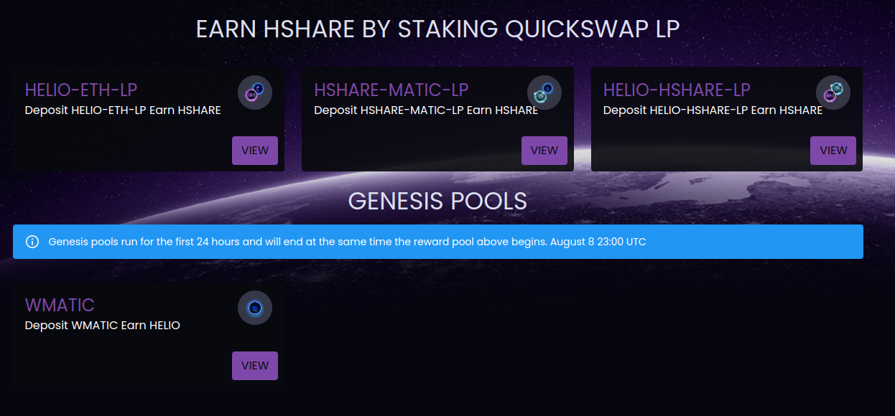

# Farms

To incentivize healthy liquidity pools for the Helio Cash protocol tokens, our LP farms have been seeded with HSHARE to be distributed as rewards to LP stakers across a time period of 12 months. The total HSHARE rewards are distributed from each farm as follows:

Farms will continue rewarding HSHARE until the max supply of HSHARE (28K) is reached, at which point emissions stop. This is going to be in a year from when the HSHARE farms started.

There are two farms users can participate in to earn HSHARE:

1. [Deposit](https://helio.cash/farm/HelioEthHShareRewardPool) HELIO-ETH-LP to earn HSHARE
2. [Deposit](https://helio.cash/farm/HShareMaticHShareRewardPool) HSHARE-MATIC-LP to earn HSHARE

### **1. What will happen when the circulating supply equals the total supply? Will reward emissions stop?**

Yes. Once the max supply of HSHARE (28K) is reached, reward emissions end. This will happen in exactly one year from when the HSHARE farms started on July Xth, 2022. HSHARE will always continue to print HELIO in the Boardroom, though, as long as HELIO remains above peg.


HSHARE reward emissions for the current LP farms are scheduled to end on July Xth, 2023 once the total HSHARE supply has been distributed.


### 2. Why is "at-peg" (TWAP between 1.00 and 1.01) the best time to provide liquidity?

When HELIO is pegged or close to being pegged at 4,000 HELIO to 1 ETH, it is more akin to having exposure to a single asset (single staking) than to your traditional LP'ing experience, where you would run the risk of impermanent loss if one of the tokens went up in value and the other did not.

### 3. Wait, you mean that if ETH pumps, HELIO pumps with it?

**Yes!**\
\
Let's look at an example:\
\
If ETH pumps in price, it won't "outrun" HELIO , even if nobody is buying HELIO at that time.\
\
The farm APRs will vary in terms of USD value, but the emissions won’t. This is something that wouldn't be possible with another 1:1 pegged asset like a stablecoin LP position, where the USD value is directly tied to the emissions. If ETH rises in USD value, HELIO goes with it. Similarly, if ETH falls in USD value, HELIO will be worth less in USD, **but it won’t affect the peg**.


The only thing that can change the price of HELIO in terms of its ETH value (and as such, the peg) is buying and selling it.

